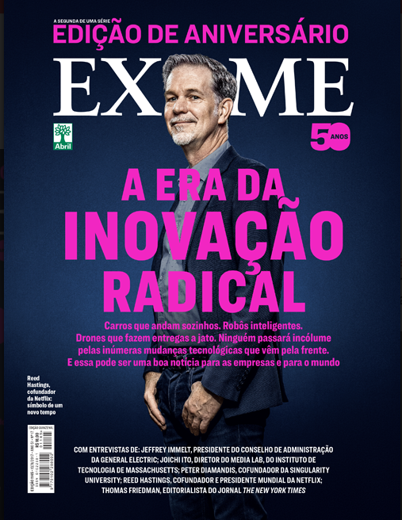
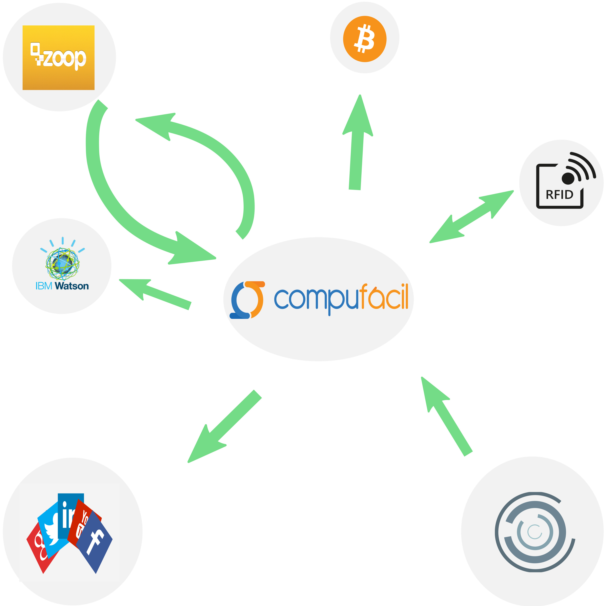

build-lists: true
autoscale: true

# O Futuro e a **CompuFácil**

----

# /sobre

----

# Futuro ?

-----

---

## Estamos no período mais próspero da história da humanidade

----

----

# Sustentabilidade = eficiência

 - Infraestrutura compartilhada
 - Não se vende computadores, vende-se computação
 - Custo por demanda
 - Facilidade de automatização 
 - *Serverless*

---

# Nuvem

 - Dados centralizados
 - Detectar erros antes dos próprios clientes
 - Novas versões instantaneamente
 - Acesso em qualquer lugar, qualquer dispositivo conectado

---

# Economias Compartilhadas

 - A maior empresa de carros do mundo não tem carros
 - A maior empresa de imóveis do mundo não possui imóveis
 - A maior empresa de comércio eletrônico do mundo não tem estoque

 ~ Edson Yanaga

---

# Blockchain

 - Dinheiro online, descentralizado, global
 - Novos modelos de negócios
 - Novas formas de se pensar sobre gestão financeira
 - Ferramentas de investimento
 - Sistemas de votação

---

# Internet das coisas (IOT)

- Em 2015 existiam 4.9 milhões de dispositivos conectados a internet

- Em 2020 estimas-se 21 bilhões

- [Amazon Go](https://www.youtube.com/watch?v=NrmMk1Myrxc)

---

# Big Data

- Dados centralizados permitem a mineração
- Descobrir o que vai acontecer
- Relacionamentos inesperados de dados
- Prevenção de problemas antes do acontecimento

---

# Inteligência Artificial

- Carros autônomos
- Detecção de humor
- Profissões artificiais (advogados, juízes, etc)
- Bots
- Assistentes pessoais (Alexa, Siri)
- *AI will be the new UI*

---

# O que mais?

 - Impressoras 3D
 - Wearable's
 - Drones
 - Energia Solar
 - Realidade virtual/aumentada
 - Mapeamento Genético
 - Customização genética (CRISPR)

---

# O Futuro e a **CompuFácil**

---

# ~~O Futuro e a~~ **CompuFácil**

---

---

---

## O mundo já tem muitas ideias geniais

## Para criar mais valor precisamos juntar elas

---

---

# Nossos aplicativos

---

---

---

---

---

---

# Ideias

- Nota fiscal de serviço para alguns municípios
- Messenger para receber novidades sobre vendas e vencimentos
- Criação automática de promoções baseada no vencimento de itens
- Mineração de melhores datas para entrar em contato com os clientes
- Checkout automático com RFID de produtos especiais
- Importador de transações bancárias fazendo crawling

---

# Ideias

- Pagamento direto sem necessidade de cartão com NFC ou Bitcoin
- Ferramenta para análise do perfil do cliente oferecer promoções
- Capturar informações de produtos como o RDstation para
    qualificar leads e direcionar para os nossos parceiros.
- Redução do estoque através da análise de comportamento dos
    clientes por sazonalidade
- Importador de histórico de estoque do Excel para a nossa API

---

# O que você vai fazer?

---

> The difference between a successful person and others is not a lack of strength, not a lack of knowledge, but rather a lack in will.

~ Vince Lombardi Jr.

# Obrigado

